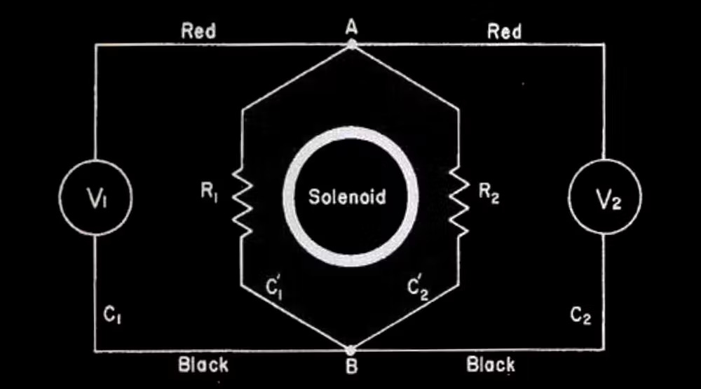
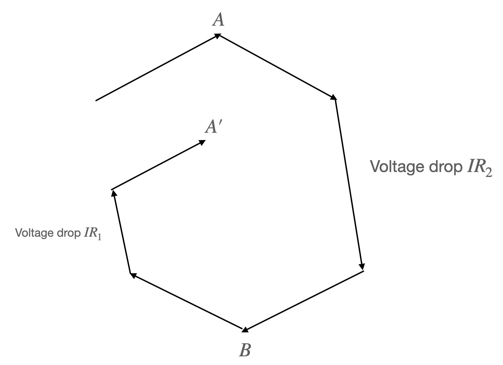
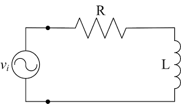
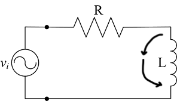

In his MIT 802 [lecture 16](https://www.youtube.com/watch?v=nGQbA2jwkWI), ex Prof. Walter Lewin made the claim that Kirchhoff's Loop Rule doesn't hold in the presence of a changing magnetic field and is only a special case of the Faraday's Law. He repeated the claim later in a video titled ["Kirchhoff's Loop Rule is for the birds"](https://www.youtube.com/watch?v=LzT_YZ0xCFY). Electrical engineer Mehdi Sadadhgar rebuked the claim in two videos: [first one](https://www.youtube.com/watch?v=0TTEFF0D8SA), and the [second one](https://www.youtube.com/watch?v=Q9LuVBfwvzA). I will quickly summarize their claims and provide some analysis of their thought experiment setups. This is not a debate on semantic I believe. There's only one right answer. I don't claim expertise on this subject, so take my words with a grain of salt (and you can email me if you take issues with my claims). 

### Content

1. [Prof. Walter Lewin's claim](#kirchhoff-voltage-law-does-not-hold)
2. [Sadadhgar's claim](#kirchhoff-voltage-law-does-hold)
3. [Is Kirchhoff's Voltage Law legit?](#conclusion)

### Kirchhoff Voltage Law does not hold

According to Prof. Walter Lewin, electric potential is defined as the scalar function $V$ such that $\bold{E} = -\nabla V$. And voltage is defined, in his case, as the difference in electric potential between two points: $\Delta V = V_1 - V_2$. **Kirchhoff's Voltage Law** is a statement about all the voltage changes across a closed loop (usually a circuit). The statement is that $\sum \Delta V = 0$. In integral form, we can write it as $\oint dV = 0$ or $\oint \bold{E}  \cdot \bold{dl} = 0$. 

Given this formulation of Kirchhoff's Voltage Law (KVL), Prof. Walter Lewin argued that KVL doesn't hold when there exists a changing magnetic field. This is because by Maxwell-Faraday's Law, $\nabla \times \bold{E} = -\frac{d\bold{B}}{dt}$. When there's changes in $\bold{B}$ over time, the curl of $\bold{E}$ is nonzero. Therefore, $\bold{E}$ is not a conservative field and so the closed loop path integral of $\bold{E}$ is not equal to $0$. 

In fact, the integral form of Maxwell-Faraday's Law states that

$$
\oint\limits_{\partial \sigma}\bold{E}\cdot \bold{dl}=-\iint\limits_{\sigma} \frac{\partial \bold{B}}{\partial t}\cdot \bold{dA} \\
= -\frac{d\Phi_B}{dt}
$$

The term $-\frac{d \Phi_B}{dt} = \mathcal{E}$, which stands for the electromotive force induced by the changing magnetic field. In summary,

$$
\oint \bold{E}\cdot \bold{dl} \not = 0 \\
\oint \bold{E}\cdot \bold{dl} = -\frac{d\Phi_B}{dt}
$$

Prof. Walter Lewin then gave an example set up of where this difference comes to be significant. 

Consider the rhombus-like circuit, where within there's a solenoid that creates an increasing magnetic field outwards towards us. By the right-hand-rule, we know that should induce a current in the clockwise direction in the rhombus circuit, because it creates an EMF in that direction. Let the EMF be fixed. We denote it as $\mathcal{E}$. Then, since the total resistance is $R_1+R_2$, the current $I = \frac{\mathcal{E}}{R_1+R_2}$, which is also fixed. Now, the voltage drop across resistor $R_2$ following from $A$ to $B$ is equal to $IR_2$. Therefore, by common sense, the voltemeter $V_2$ should measure $IR_2$. On the other hand. the voltage drop across $R_1$ following from $A$ to $B$ is equal to $-IR_1$ (the negative sign arises because we are going against the current). Thus we expect $V_1$ to measure $-IR_1$. The seeming paradox is that both $V_1$ and $V_2$ are measuring the voltage drop across $A$ and $B$ and therefore should measure the same value, right? No! The reason is because the electric field is no longer a conservative field and the electric potential is hardly well-defined. We cannot find a scalar function such that $\bold{E} = -\nabla V$. 

The simple solution is to say the electric potential is no longer well-defined. But one can also insist another definition of $V$ that sort of works. We can define $V = \int \bold{E}\cdot \bold{dl}$ against some chosen datum. Then, the shape of $V$ in our circuit will look something like this.

The $V$ function is no longer continuous but instead goes down all the time as we rotate clockwise along the circuit, like a staircase/helius. When we measure the voltage drop from $A$ to $B$ across $R_2$, we are following the path downward from $A$ to $B$. But when we measure the voltage drop across $V_1$ from $A$ to $B$, we are following the upward path from $A'$ to $B$. 

**But the two voltemeters are identical. What decides the voltage they measure?** To understand why $V_2$ measures $IR_2$, we can apply KVL to enclosed loop that contains $R_2$ and $V_2$. KVL holds in this closed loop because there is no changing magnetic flux here. 

Another setup that Prof. Walter Lewin discusses is that of an ideal inductor. Take an RL circuit. 

By Maxwell-Faraday's Law, we know

$$
- V + IR = -\frac{d\Phi_B}{dt} \\
-V + IR = -L\frac{dI}{dt} \\
IR + L\frac{dI}{dt} = V
$$

Prof. Lewin argues that $L\frac{dI}{dt}$ shouldn't be treated as part of voltage, because it really is the $\frac{d\Phi_B}{dt}$ from the changing magnetic field. If one hooks up the two sides of the inductor $L$ with a voltemeter, one would see the reading of the voltage drop to be equal to $L\frac{dI}{dt}$. This is obvious by considering the Maxwell-Faraday's Law of the closed circuit consisting of $L$ and the voltemeter. 

### Kirchhoff Voltage Law does hold

In his second video, Sadadhgar points out that Prof. Lewin doesn't use the correct definition of voltage. He defined voltage difference between two points $A$, $B$ as the work per unit charge needed to move a test charge between $A$ and $B$. Then, Sadadhgar proves the KVL as follows: KVL is a statement of the conservation of energy. Consider moving a test charge through a closed loop. The kinetic energy theorem gives that $\Delta KE = \oint dW$. For a circuit, it's reasonable to assume that $\Delta KE=0$ (else the current wouldn't be in a stable state). Thus, we can conclude

$$
0 = \oint dW = \oint \frac{dW}{q} = \oint \frac{\bold{F}\cdot \bold{dl}}{q} = \oint \bold{E}\cdot \bold{dl}
$$

Note that there's an important issue with the final equality here. When we consider the work needed to move a test charge, it matters tremendously what forces we take into account. The kinetic energy theorem only works if we take into account all works. That means, we have to account for frictional forces, electric force, and the forces that drive the transportation of charge inside the battery (chemistry). That clearly wouldn't be a valid statement of the KVL. Because if we consider all forces, than the work to move a test charge across any electrical component is practically $0$ because the test charge doesn't usually change in $KE$ after crossing the electrical component. If that is the case, $IR$, $\frac{Q}{C}$ and other similar formula lose their meanings. So, we can conclude that this is not a proper way to define KVL. 

Now, the statement of KVL can be revised as follows: KVL states that the work per unit charge done against the electric force to move a test charge through a closed loop is $0$. However, if we adopt this definition, we must note that this is the same statement as

$$
\oint \bold{E}\cdot \bold{dl} = 0
$$

This, if we remember the previous section, leads to the inevitable conclusion that KVL doesn't hold in the presence of a changing magnetic field.

To analyze a specific setup, let's return to the RL circuit setup. 

Unlike Prof. Lewin, who uses Maxwell-Faraday's Law to arrive at

$$
- V + IR = -\frac{d\Phi_B}{dt}
$$

Sadadhgar suggests that we take another perspective. We use the KVL but use a revised definition of voltage. We arrive at

$$
- V + IR + \frac{d\Phi_B}{dt} = 0 \\
-V +IR + L\frac{dI}{dt} = 0
$$

This prompts us to consider $\frac{d\Phi_B}{dt}$ to be part of the voltage. And this is the crux of the argument. Prof. Lewin believes this is not part of the voltage. Sadadhgar believes it is. To phrase in a more important manner, Prof. Lewin believes the voltage drop across $L$ is $0$, Sadadhgar believes the voltage drop is $L\frac{dI}{dt}$. Who is right?

### Conclusion

If we take the definition of voltage drop as $\int \bold{E}\cdot \bold{dl}$, then without a doubt Prof. Lewin is correct, because there can be no electric field inside the inductor $L$. Since $L$ doesn't have resistance. If there's a electric field, the $KE$ will change. The changing $KE$ and charge velocity means a change in the charge distribution that will quickly cancel out the electric field, or in other words, re-reach temporary static equilibrium. Thus the electric field is $0$ inside $L$ by necessity. This is discomforting because we learned that the inductor or any change in magnetic fluxes induces an electric field. Where does that electric field go? First, it should be noted that what we learned is a change in magnetic flux induces an EMF (which is sort of like the total electric field you will get if you go around a loop, or more formally $\oint \bold{E}\cdot \bold{dl}$). But changing magnetic field does induce an electric field (that's how electromagnetic wave works). The answer is that the induced $E$ field creates a movement of charge that changes the charge distribution within the circuit. It changes the charge distribution such that the electric field inside any resistance equal to $0$ piece of the wire is equal to $0$. All the electric field/EMF is concentrated at places with resistance. In this case, that is the $R$ in the circuit. To balance out the induced electric field in $L$, there should be a lump of positive charge at the front of $L$ in clockwise direction, and a lump of negative charge at the tail of $L$. The clockwise $E$ field created by the static charge distribution balances with the counterclockwise induced electric field, and effectually shifts the EMF away. Thus, it retains a $E=0$ inside $L$.

The question then becomes, is there a definition of voltage change under which Sadadhgar's claim of the voltage drop equaling $L\frac{dI}{dt}$ is right? 

**What if we define the voltage drop across $L$ as the work per unit charge needed to move a test charge across $L$?** That wouldn't work because the work needed to move a test charge across $L$ is $0$, since there's no electric force, or frictional force, or whatever force inside $L$.

Our conclusion 1: **there is no theoretically satsifying way to define $V$ such that KVL holds and the voltage drop across the inductor is $L\frac{dI}{dt}$.** Thus, from a theoretical purist point of view, Prof. Lewin is correct. (There's one caveat with this conclusion, one can augment the scalar potential to a vector potential and make it conservative. See Griffith or this [wiki](https://en.wikipedia.org/wiki/Electric_potential#Generalization_to_electrodynamics)).

But can we still formulate a definition of voltage whereby we can just say the voltage across a inductor is $L\frac{dI}{dt}$ and KVL holds? 

**Why do you keep pursuing a definition such that KVL holds?** Because working with KVL is simpler than working with Maxwell-Faraday's Law, for most practical purposes. For one, consider this setup (which Prof. Lewin provided).

I just added two imaginary arrows to our previous setup. If we follow along the arrow and take $\int \bold{E}\cdot \bold{dl}$, we get the voltage drop across the arrow path is $L\frac{dI}{dt}$. Remember that in the presence of a changing magnetic force, the electric field is non-conservative and thus the voltage drop is dependent on the path we take. We know this for sure because we can apply Maxwell-Faraday's Law to the closed loop formed by the imaginary arrows and $L$. In fact, across almost any path we take except the ones that go into the coils of $L$, we will measure a voltage drop of $L\frac{dI}{dt}$, because the magnetic field lines in $L$ is fairly contained. This simplification is called the lump model explained by Sadadhgar in his second video and by Prof. Feynman in chapter 22 of his lecture notes. Therefore, it seems almost ridiculous that we cannot just claim the voltage drop across $L$ is $L\frac{dI}{dt}$ while almost any path we take across those two points give us a voltage drop of $L\frac{dI}{dt}$. 

One thing we can do is as follows: separate the consideration of $\bold{E}_ \text{charge}$ and  $\bold{E}_ \text{induced}$. That is, the total $\bold{E} = \bold{E}_ \text{charge} +\bold{E}_ \text{induced}$, where $\bold{E}_ \text{charge}$ is the electric field created by the charge distribution. $\bold{E}_ \text{induced}$ is the electric field induced by the inductor or the changing magnetic field. Note that $\bold{E}_ \text{charge}$ is still conservative. If we define voltage change as $\Delta V = \int \bold{E}_ \text{charge}\cdot \bold{dl}$, we solve a lot of our snags. 

First, 

$$
\oint \bold{E}_ \text{charge}\cdot \bold{dl} = 0
$$

Our KVL holds, always. 

Further, remember that the charge distribution must form in such a way such that the clockwise $\bold{E}_ \text{charge}$ balances out the counterclockwise $\bold{E}_ \text{induced}$? Well, the EMF $\mathcal{E}$ induced is $-L\frac{dI}{dt}$ across $L$ that means the voltage drop due to the $\bold{E}_ \text{charge}$ must also have a magnitude of $L\frac{dI}{dt}$ but in the clockwise direction. 

Now we have it! If we consider the voltage change to be defined by $\int \bold{E}_ \text{charge}\cdot \bold{dl}$, then we can safely say the voltage drop across $L$ is $L\frac{dI}{dt}$. 

In a practical sense, this is very useful, since you don't have to consider carefully with Maxwell-Faraday's Law why the voltage drop along one path is different from the voltage drop across another. 

In theory, there's no ways to distinguish whether a particular $\bold{E}$ field is $\bold{E}_ \text{charge}$ or $\bold{E}_ \text{induced}$, so our definition of voltage change is theoretically unsatisfying. 

Conclusion 2: **if we define $\Delta V = \int \bold{E}_ \text{charge}\cdot \bold{dl}$, we can keep our KVL and other assumptions, but this definition is theoretically unsettling.**
